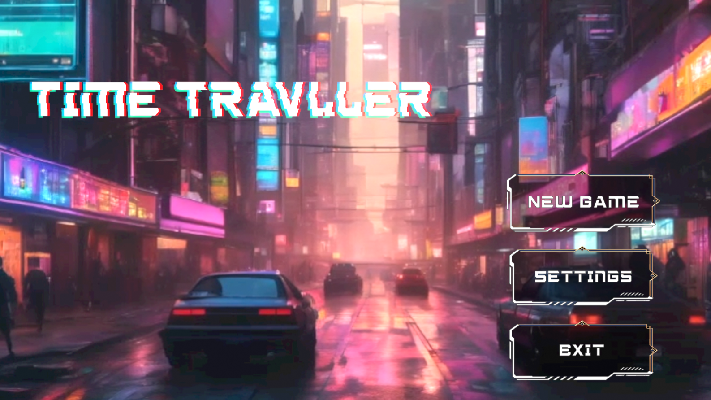
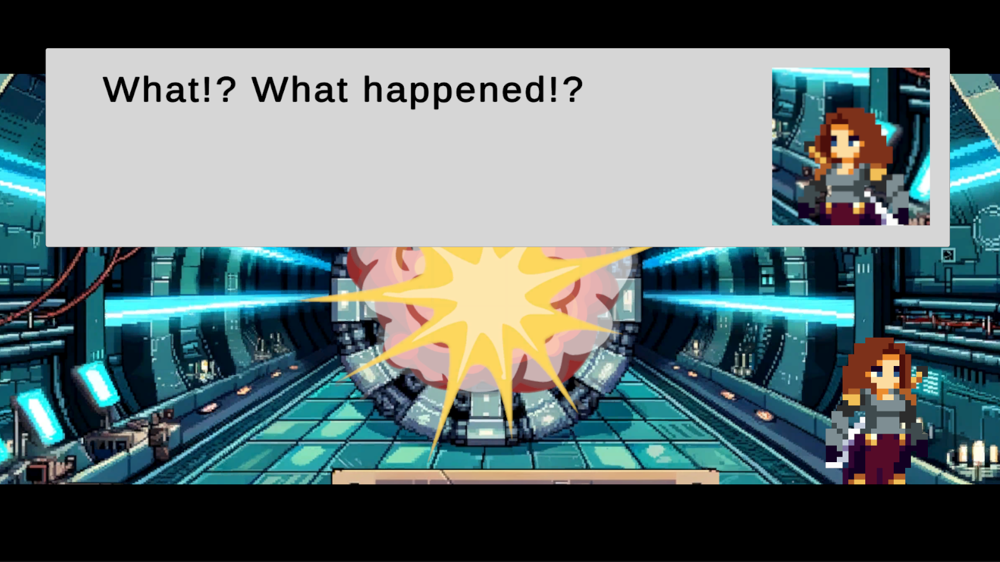
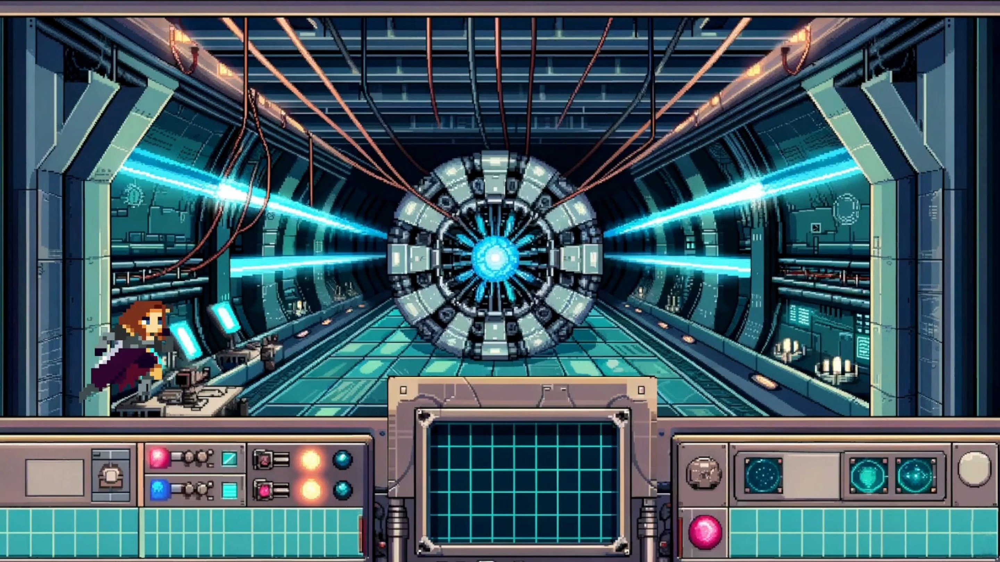
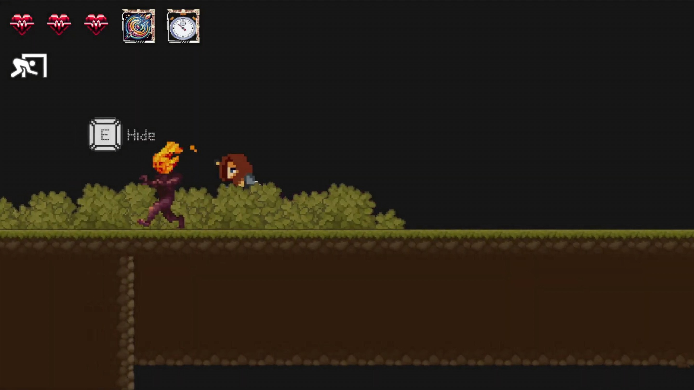
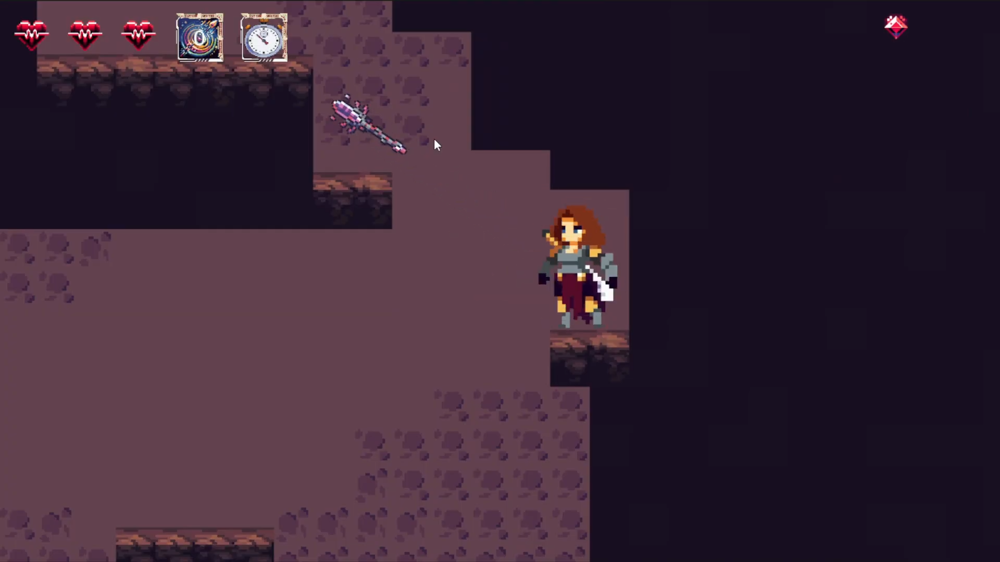
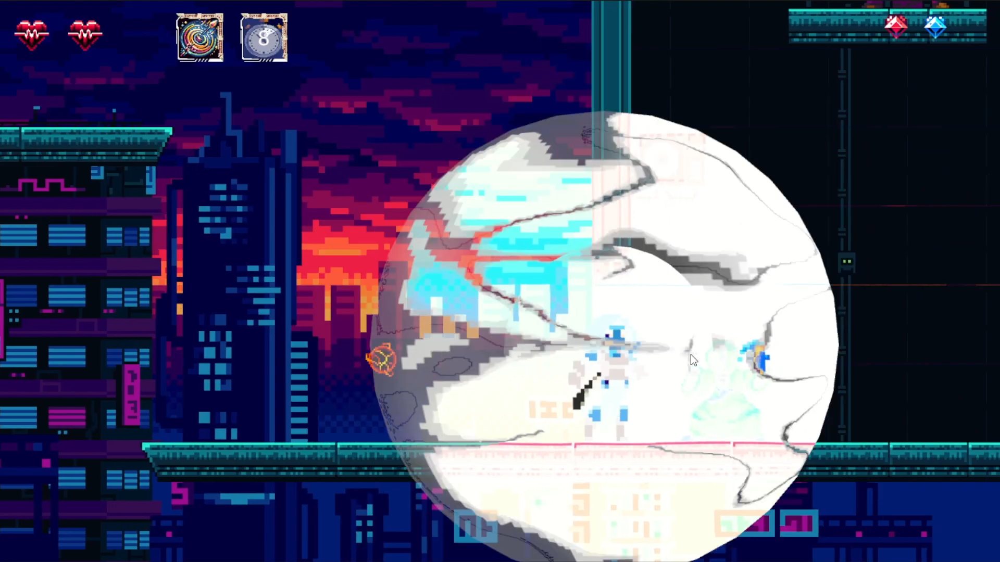
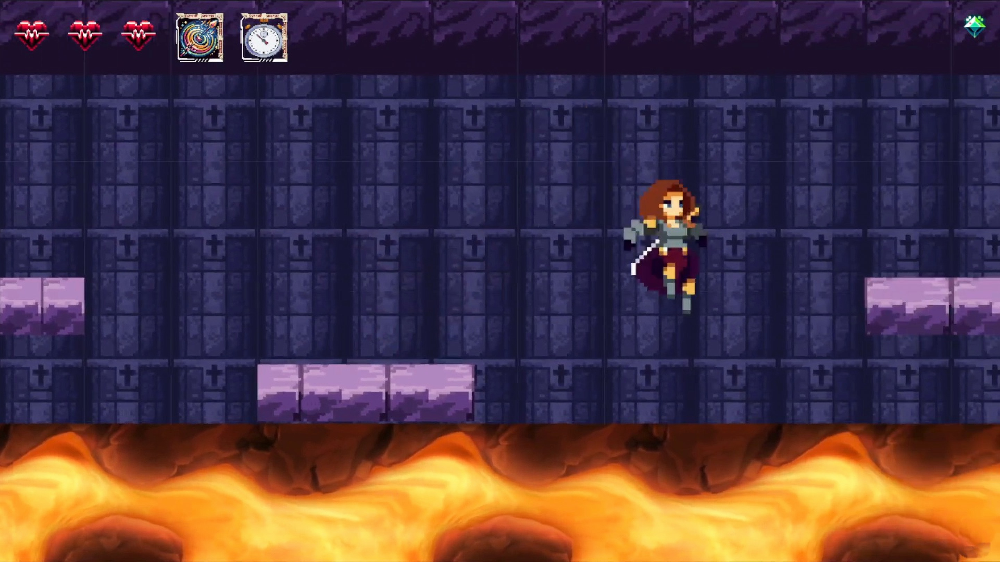

# ⏳ Elina

A side-scrolling **platformer** built in **Unity**, where players control **Elina**, a brilliant scientist trapped in a time loop. Use time-based powers to explore dangerous worlds, solve puzzles, and fight monsters across **medieval** and **cyberpunk** eras.

---

## 🔧 Features

- Side-scrolling platformer gameplay with story-driven progression
- Time travel between **medieval** and **cyberpunk**
- Unlockable abilities: **Teleportation**, **Time Stop**, and **Era Switching**
- Stealth mechanics, parkour, and environmental puzzles
- Puzzle dungeon with era-switching
- Pixel-art visuals with cyberpunk + fantasy themes
- Dialogue system

---

## 🖼️ Screenshots

### Main Menu

### Dialogue System 

### Level 1 (Start and end of the game)  

### Level 2 (Tutorial and Stealth)

### Level 3 (Teleport Spear)

### Level 4 (Time Stop)

### Level 5 Era Switching Puzzle

---

## 🎬 Trailer  

  

